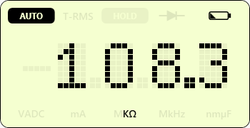
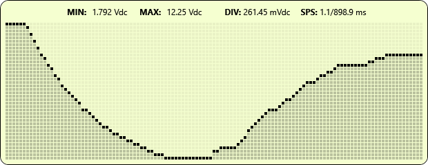

# IDM73 Interface

**Version:** 1.0.0  
**Developer:** SirGr3mlin

Free PC software for RS PRO IDM73 and compatible digital multimeters.

---
## Description

IDM73 Interface is a custom-built modern application designed to interface with IDM73-based digital multimeters across multiple brands via the IR RS232 communication interface.

The software provides real-time data capture, graphing, logging, and monitoring through a clean instrument-style interface.

## Features
- Real-time serial data monitoring (RS232 / IR interface)
- Live graphing display
- Min / Max / Scale (DIV) tracking
- Logging and capture functionality
- Configurable dark/light theme
- Window position memory (multi-monitor support)

## Screenshots

## Download

**[⬇️ Download Latest Version](https://github.com/SirGr3mlin/IDM73-Interface/releases/latest)**

## How to Use
1. Connect your IDM73-compatible device via IR RS232 / Optical interface.
2. Right-click (on UI) and select the correct COM port under "Connection -> Ports".
3. Click **Connect**.
4. Data will begin streaming once a successful connection is established.

## Requirements
- Windows 10 or 11 (64-bit)
- IR RS232 / Optical interface cable

> **Note:** This project has **not been tested** with the original interface cable (as I was unable to obtain one). Results may vary.

## Notes
- This version is **fully standalone** — it includes all required .NET files. No additional runtime installation needed.
- Make sure the correct COM port is selected before connecting.

## Terms of Use
Free for personal and non-commercial use.

## Disclaimer
This software is provided **"as is"** without warranty of any kind. Use at your own risk.

## Support
For help or questions, please reach out to me at: **SirGr3mlin@gmail.com**

## Support the Project
You can support development via the **Buy Me a Coffee** link in the About window. Thank you!
